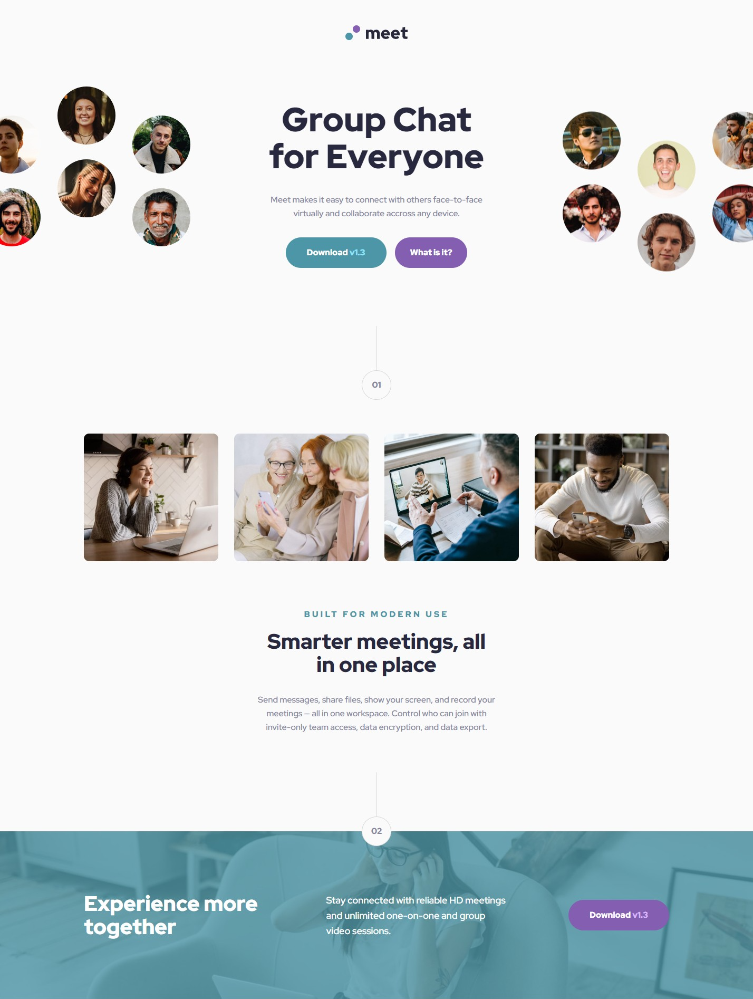
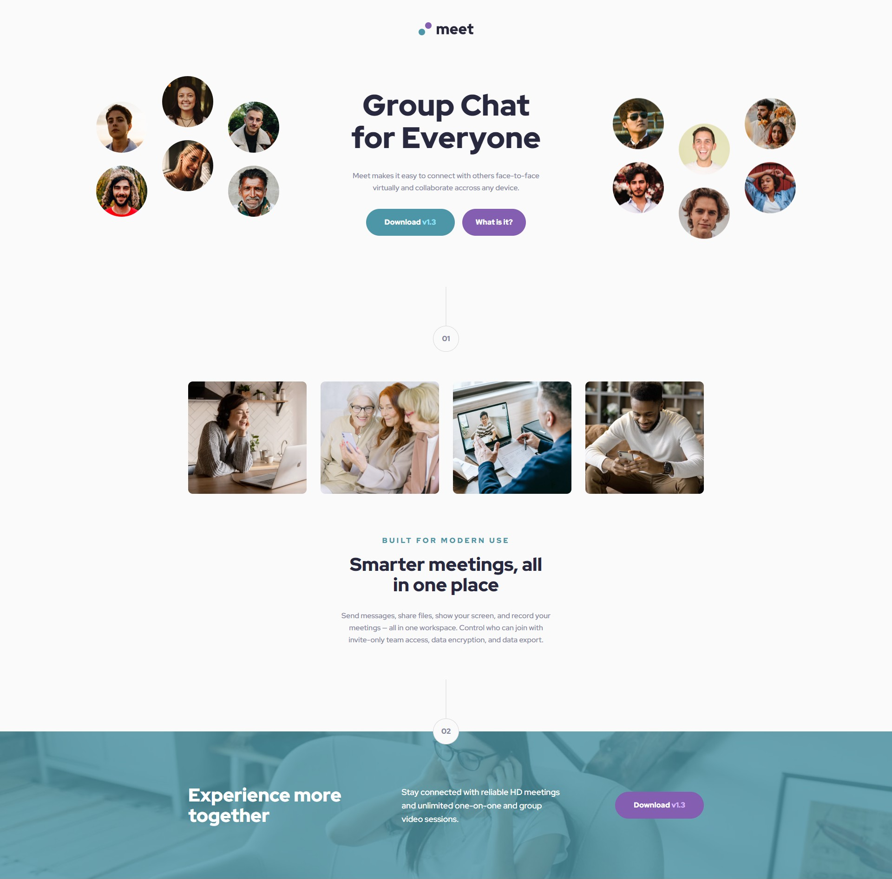

# Frontend Mentor - Meet landing page solution

This is a solution to the [Meet landing page challenge on Frontend Mentor](https://www.frontendmentor.io/challenges/meet-landing-page-rbTDS6OUR). Frontend Mentor challenges help you improve your coding skills by building realistic projects.

## Table of contents

- [Overview](#overview)
  - [Screenshot](#screenshot)
  - [Links](#links)
  - [Built with](#built-with)
- [Author](#author)

**Note: Delete this note and update the table of contents based on what sections you keep.**

## Overview

Mobile-first Responsive Meet Landing Page

### Screenshot

1440px

1920px

Screenshot for 1920px and 1440px screen width.

### Links

- Solution URL: [Add solution URL here](https://www.frontendmentor.io/solutions/mobilefirst-responsive-meet-landing-page-TH-6xYVwf)
- Live Site URL: [Add live site URL here](https://meet-landing-page-tau-nine.vercel.app/)

### Built with

- Semantic HTML5 markup
- SCSS
- Flexbox
- Mobile-first workflow

## Author

- Website - [James Manalang](https://jaesmanalang.github.io/portfolio/)
- Frontend Mentor - [@jaesmanalang](https://www.frontendmentor.io/profile/jaesmanalang)
